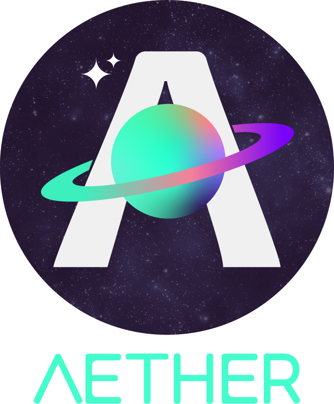
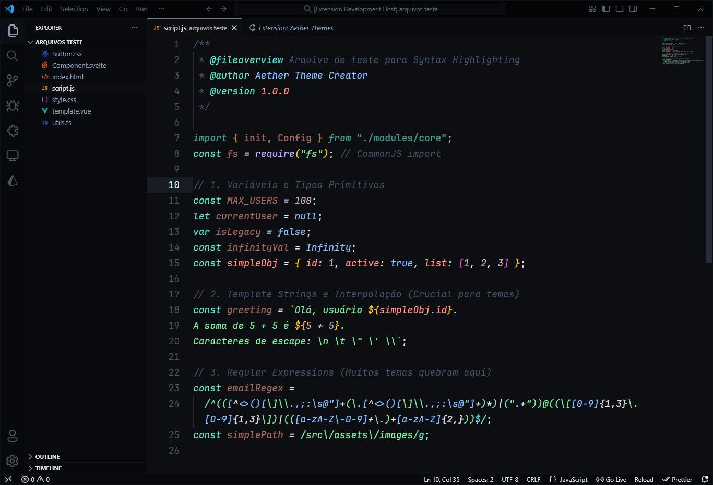
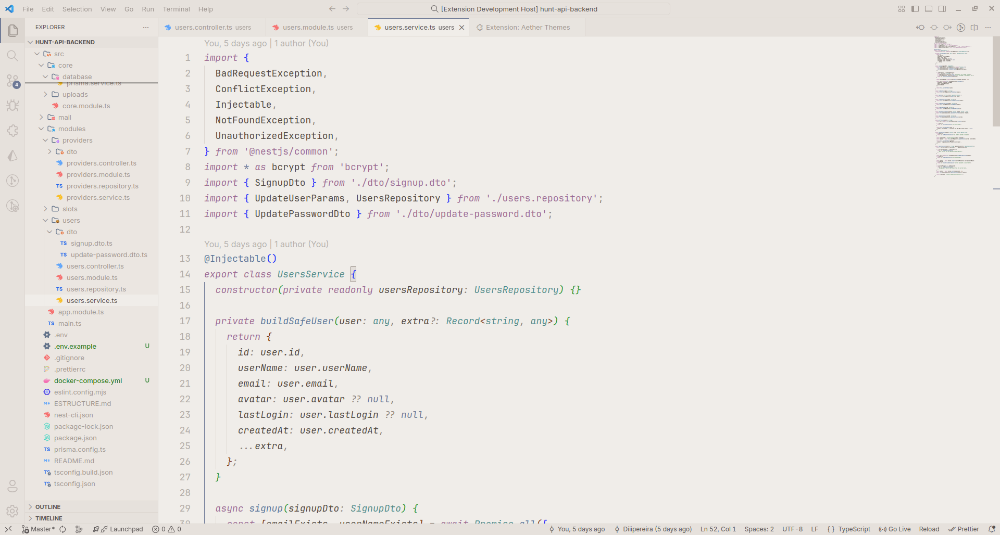
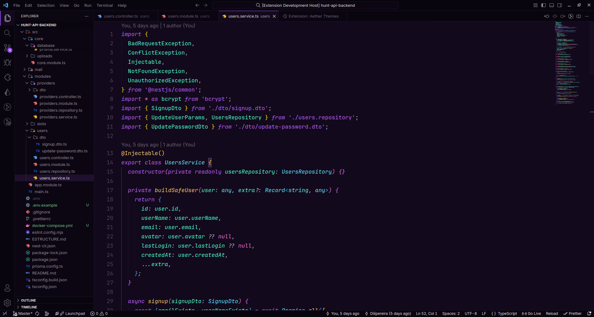
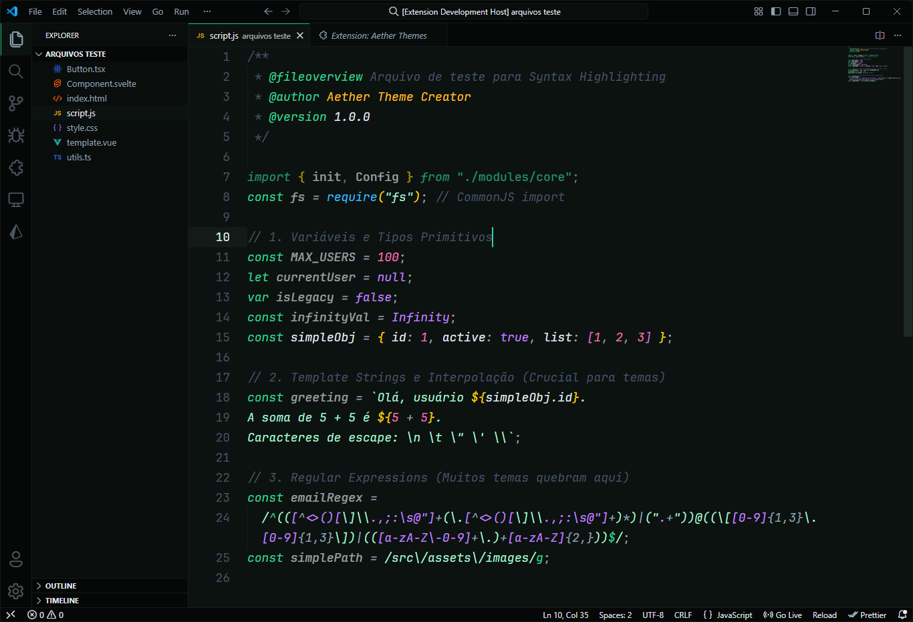
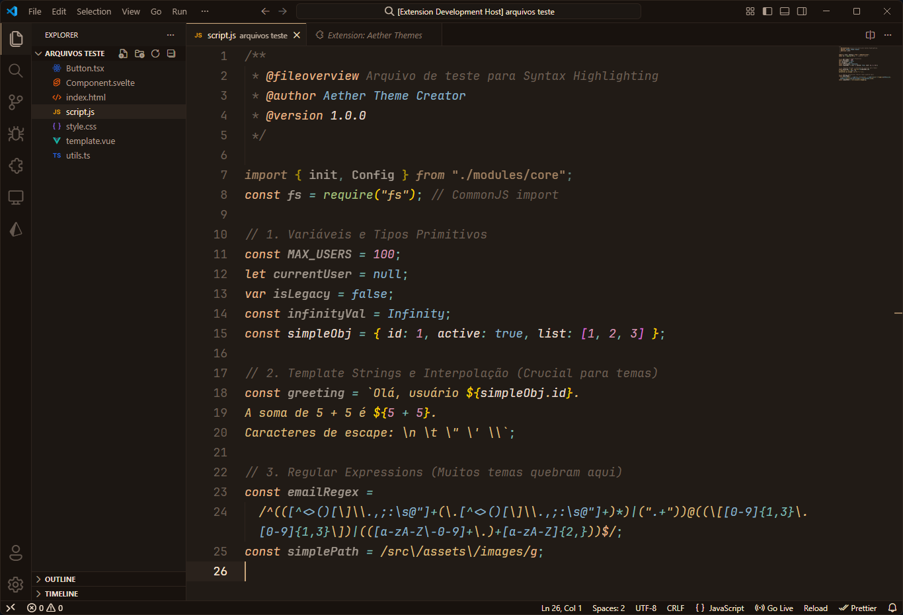
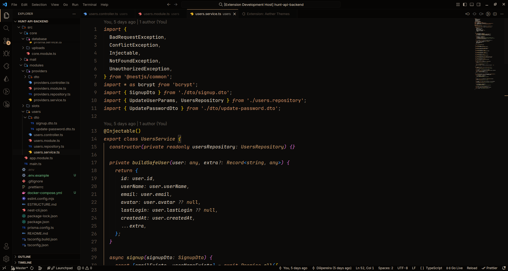

<div align="center">
  
  
  <p>
    <strong>A premium collection of modern themes for Visual Studio Code.</strong><br>
    Designed with absolute focus on visual experience, precise colors, and balanced contrast.
  </p>
</div>

<br>

<div style="font-size: 24px; font-weight: 700;">✨ Introduction</div>
<br>

The **Aether Themes** collection was created to provide a modern, comfortable, and premium visual experience. Whether you prefer dark, light, nature-inspired, or warm coffee tones, this collection has been crafted with you in mind.

We offer comprehensive support for the most popular languages on the market, ensuring consistent syntax highlighting and a deep UI customization.

<br>

<div style="font-size: 24px; font-weight: 700;">🎨 Themes Preview</div>

<p style="color: #94a3b8; font-style: italic;">
  Click on the images to view in high resolution.
</p>

<table width="100%" border="0" cellspacing="0" cellpadding="10">
  <tr>
    <td width="50%" align="left" valign="bottom" style="border: 0;">
      <strong>Aether Dark</strong><br><br>
      <a href="https://raw.githubusercontent.com/diiipereira/aether-theme/main/images/screenshot-dark.png" target="_blank">
        
      </a>
    </td>
    <td width="50%" align="left" valign="bottom" style="border: 0;">
      <strong>Aether Light</strong><br><br>
      <a href="https://raw.githubusercontent.com/diiipereira/aether-theme/main/images/screenshot-light.png" target="_blank">
        
      </a>
    </td>
  </tr>
  <tr>
    <td width="50%" align="left" valign="bottom" style="border: 0;">
      <strong>Dark Space</strong><br><br>
      <a href="https://raw.githubusercontent.com/diiipereira/aether-theme/main/images/screenshot-dark-space.png" target="_blank">
        
      </a>
    </td>
    <td width="50%" align="left" valign="bottom" style="border: 0;">
      <strong>Emerald</strong><br><br>
      <a href="https://raw.githubusercontent.com/diiipereira/aether-theme/main/images/screenshot-emerald.png" target="_blank">
        
      </a>
    </td>
  </tr>
  <tr>
    <td width="50%" align="left" valign="bottom" style="border: 0;">
      <strong>Aether Coffee</strong><br><br>
      <a href="https://raw.githubusercontent.com/diiipereira/aether-theme/main/images/screenshot-coffee.png" target="_blank">
        
      </a>
    </td>
    <td width="50%" align="left" valign="bottom" style="border: 0;">
      <strong>Coffee Dark</strong><br><br>
      <a href="https://raw.githubusercontent.com/diiipereira/aether-theme/main/images/screenshot-coffee-dark.png" target="_blank">
        
      </a>
    </td>
  </tr>
</table>

<br>

<div style="font-size: 24px; font-weight: 700;">⭐ Highlights</div>
<br>

- **Refined Syntax (Tokens):** Dedicated colors to distinguish logic, types, and data in:
  - `JavaScript`, `TypeScript`, `React (JSX/TSX)`, `Svelte`
  - `Python`, `Java`, `Go`, `Rust`, `PHP`
  - `C`, `C++`, `C#`
  - `HTML`, `CSS`, `SCSS`, `Tailwind`
  - `SQL`, `JSON`, `YAML`, `TOML`
- **Deep UI Styling:** We don't just style the editor. We cover the entire workbench:
  - Buttons, Inputs, Dropdowns, and Badges.
  - Integrated Terminal and Search UI.
  - Subtle Scrollbars.
  - Clean Git Diff View (Added/Removed/Modified).
- **Premium Markdown:** Clean visuals for Headings, Blockquotes, Links, Lists, and Code Blocks.
- **Semantic Highlighting:** Full support for VS Code's semantic engine to distinguish variables, parameters, interfaces, and readonly properties.

<br>

<div style="font-size: 24px; font-weight: 700;">📦 Installation</div>
<br>

**Via Marketplace**

1.  Open the **Extensions** sidebar in VS Code.
2.  Search for `Aether Themes`.
3.  Click **Install**.

<br>

**Via CLI**

```sh
    code --install-extension diiipereira.aether-theme
```

<br>

<div style="font-size: 24px; font-weight: 700;">🔧 Recommended Settings</div>
<br>

For the best visual experience, add these to your `settings.json`:

```json
{
  "editor.cursorBlinking": "smooth",
  "editor.cursorSmoothCaretAnimation": "on",
  "editor.renderLineHighlight": "all",
  "editor.fontFamily": "'JetBrains Mono', 'Fira Code', monospace",
  "editor.fontLigatures": true
}
```

<br>

<div style="font-size: 24px; font-weight: 700;">❤️ Credits</div>
<br>

Created and maintained by [Diogo Pereira](https://github.com/Diiipereira) and [Eliel Douglas](https://github.com/ElielDouglas).

<br>

<div style="font-size: 24px; font-weight: 700;">📄 License</div>
<br>

[MIT License](https://raw.githubusercontent.com/Diiipereira/aether-theme/main/LICENSE)
