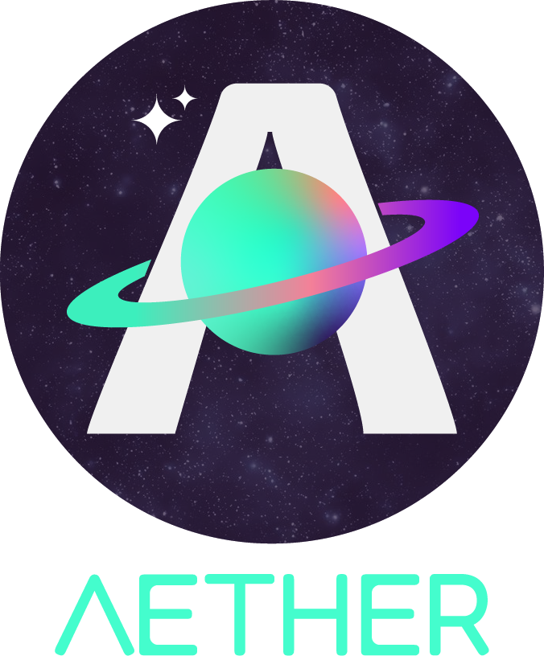
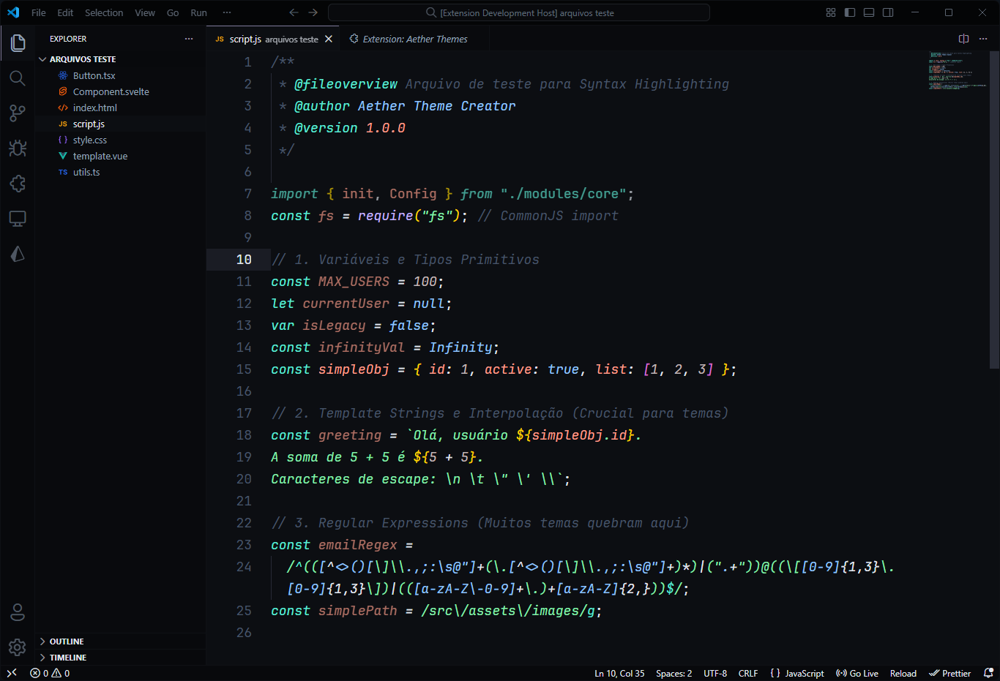
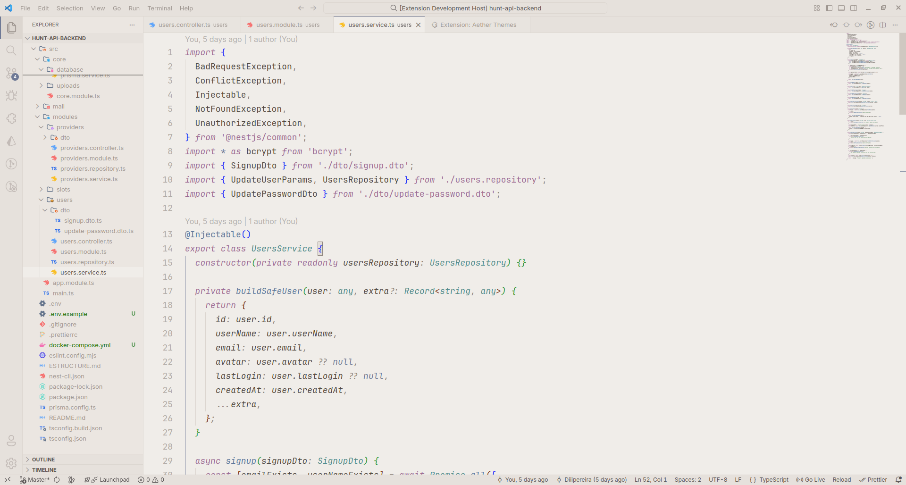
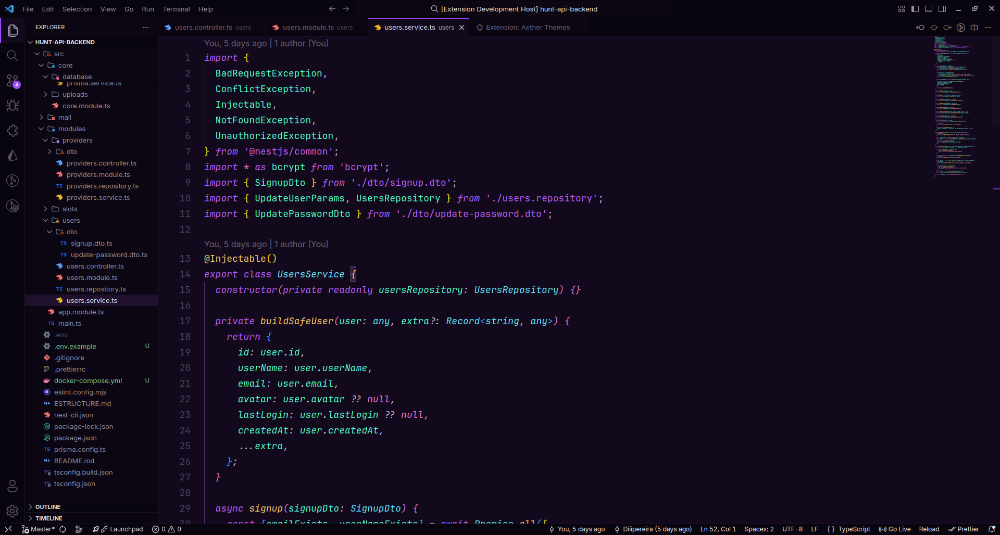
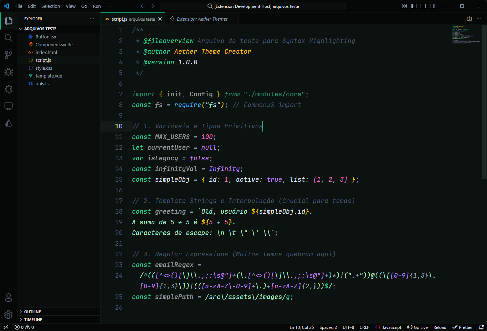
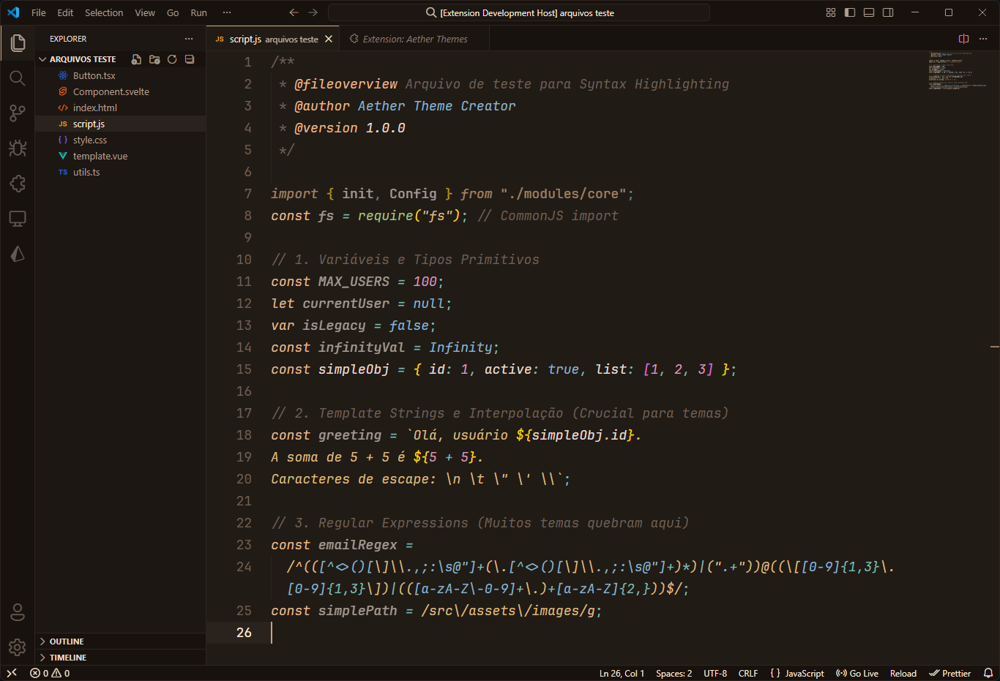
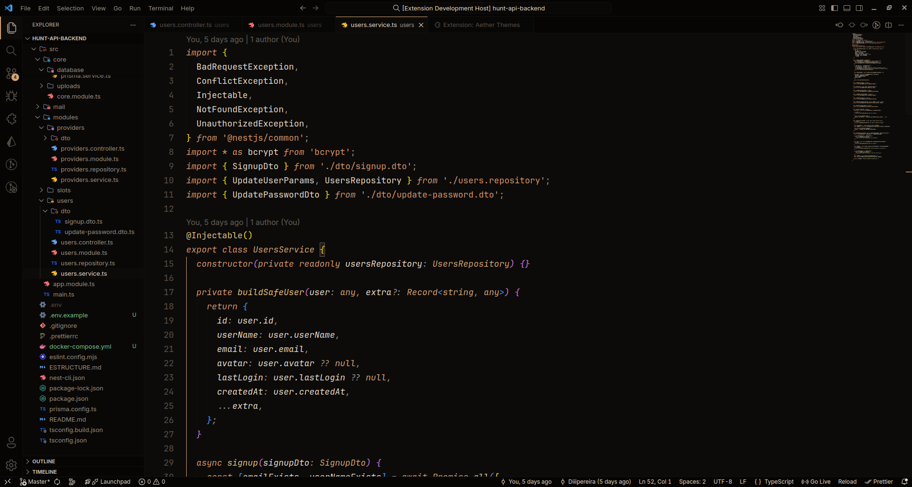

<div align="center">
  
  
  <p>
    <strong>A premium collection of modern themes for Visual Studio Code.</strong><br>
    Designed with absolute focus on visual experience, precise colors, and balanced contrast.
  </p>
</div>

<br>

<div style="font-size: 24px; font-weight: 700;">✨ Introduction</div>
<br>

The **Aether Themes** collection was created to provide a modern, comfortable, and premium visual experience. Whether you prefer dark, light, nature-inspired, or warm coffee tones, this collection has been crafted with you in mind.

We offer comprehensive support for the most popular languages on the market, ensuring consistent syntax highlighting and a deep UI customization.

<br>

<div style="font-size: 24px; font-weight: 700;">🎨 Themes Preview</div>

<p style="color: #94a3b8; font-style: italic;">
  Click on the images to view in high resolution.
</p>

<table width="100%" border="0" cellspacing="0" cellpadding="10">
  <tr>
    <td width="50%" align="left" valign="bottom" style="border: 0;">
      <strong>Aether Dark</strong><br><br>
      <a href="https://raw.githubusercontent.com/diiipereira/aether-theme/main/images/screenshot-dark.png" target="_blank">
        
      </a>
    </td>
    <td width="50%" align="left" valign="bottom" style="border: 0;">
      <strong>Aether Light</strong><br><br>
      <a href="https://raw.githubusercontent.com/diiipereira/aether-theme/main/images/screenshot-light.png" target="_blank">
        
      </a>
    </td>
  </tr>
  <tr>
    <td width="50%" align="left" valign="bottom" style="border: 0;">
      <strong>Dark Space</strong><br><br>
      <a href="https://raw.githubusercontent.com/diiipereira/aether-theme/main/images/screenshot-dark-space.png" target="_blank">
        
      </a>
    </td>
    <td width="50%" align="left" valign="bottom" style="border: 0;">
      <strong>Emerald</strong><br><br>
      <a href="https://raw.githubusercontent.com/diiipereira/aether-theme/main/images/screenshot-emerald.png" target="_blank">
        
      </a>
    </td>
  </tr>
  <tr>
    <td width="50%" align="left" valign="bottom" style="border: 0;">
      <strong>Aether Coffee</strong><br><br>
      <a href="https://raw.githubusercontent.com/diiipereira/aether-theme/main/images/screenshot-coffee.png" target="_blank">
        
      </a>
    </td>
    <td width="50%" align="left" valign="bottom" style="border: 0;">
      <strong>Coffee Dark</strong><br><br>
      <a href="https://raw.githubusercontent.com/diiipereira/aether-theme/main/images/screenshot-coffee-dark.png" target="_blank">
        
      </a>
    </td>
  </tr>
</table>

<br>

<div style="font-size: 24px; font-weight: 700;">⭐ Highlights</div>
<br>

- **Refined Syntax (Tokens):** Dedicated colors to distinguish logic, types, and data in:
  - `JavaScript`, `TypeScript`, `React (JSX/TSX)`, `Svelte`, `Vue`
  - `Python`, `Java`, `Go`, `Rust`, `PHP`
  - `Ruby`, `Kotlin`, `Swift`, `Dart`, `Scala`
  - `C`, `C++`, `C#`, `Haskell`, `Elixir`, `Lua`, `R`
  - `HTML`, `CSS`, `SCSS`, `Tailwind`, `XML`
  - `GraphQL`, `SQL`, `JSON`, `YAML`, `TOML`
  - `Markdown`, `Shell/Bash`, `Docker`, `Diff`
- **Deep UI Styling:** We don't just style the editor. We cover the entire workbench:
  - Buttons, Inputs, Dropdowns, and Badges.
  - Integrated Terminal and Search UI.
  - Subtle Scrollbars and Sticky Scroll.
  - Clean Git Diff View (Added/Removed/Modified/Renamed/Untracked/Staged).
  - Debug Console and Token Expression colors.
  - Inline Chat and AI suggestion colors (Ghost Text, Copilot).
  - Notification Center and Marker Navigation.
- **Premium Markdown:** Clean visuals for Headings, Blockquotes, Links, Lists, and Code Blocks.
- **Semantic Highlighting:** Full support for VS Code's semantic engine to distinguish variables, parameters, interfaces, and readonly properties.
- **WCAG AA Contrast:** All themes meet minimum contrast requirements for comfortable long-session coding.

<br>

<div style="font-size: 24px; font-weight: 700;">📦 Installation</div>
<br>

**Via Marketplace**

1.  Open the **Extensions** sidebar in VS Code.
2.  Search for `Aether Themes`.
3.  Click **Install**.

<br>

**Via CLI**

```sh
    code --install-extension diogo-aether.aether-dark
```

<br>

<div style="font-size: 24px; font-weight: 700;">🔧 Recommended Settings</div>
<br>

For the best visual experience, add these to your `settings.json`:

```json
{
  "editor.cursorBlinking": "smooth",
  "editor.cursorSmoothCaretAnimation": "on",
  "editor.renderLineHighlight": "all",
  "editor.fontFamily": "'JetBrains Mono', 'Fira Code', monospace",
  "editor.fontLigatures": true
}
```

<br>

**Modern UI**

VS Code's Modern UI turns each workbench area into a floating card, and every palette in this collection was rebuilt around it in v1.6.0. It ships as an experimental flag that is **off by default and rolled out gradually**, so it can be active on one machine and not on another. Pin it explicitly to get it everywhere:

```json
{
  "workbench.experimental.modernUI": true
}
```

Run `Developer: Reload Window` afterwards. Being experimental, it may change or be removed in a future release, and VS Code forks generally don't have the flag at all. All six themes are fully supported in the classic UI too, so leaving this off costs you nothing.

<br>

**Window Controls — Modern UI only (Windows & Linux)**

With VS Code's Modern UI enabled (`workbench.experimental.modernUI`), the minimize / maximize / close buttons are drawn natively by Electron. VS Code feeds that native overlay a hardcoded background — `#252526` for every dark theme and `#F3F3F3` for every light one — instead of `titleBar.activeBackground`. The result is a gray patch in the corner of the title bar that no theme can override.

This setting makes VS Code render the controls itself, so they follow the theme:

```json
{
  "window.controlsStyle": "custom"
}
```

Use `"hidden"` to remove them entirely.

You only need this on VS Code with the Modern UI turned on. In the classic UI — and in VS Code forks that don't ship the Modern UI, such as the builds installing from Open VSX — the window controls already follow the theme, so leave this setting alone. It has no effect on macOS.

<br>

<div style="font-size: 24px; font-weight: 700;">❤️ Credits</div>
<br>

Created and maintained by [Diogo Pereira](https://github.com/Diiipereira) and [Eliel Douglas](https://github.com/ElielDouglas).

<br>

<div style="font-size: 24px; font-weight: 700;">📄 License</div>
<br>

[MIT License](https://raw.githubusercontent.com/Diiipereira/aether-theme/main/LICENSE)
